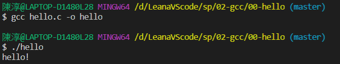
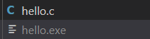

# 第一週

## 事先具備能力
>c/c++/Rust
>
>gcc/make/git/bash
>
>msys2
>
>linux
>
>nade2tetris(上學期已學過)

## 這學期要教的
>1.HackCPU 假的 設課才會用
>
>2.X86 桌上型電腦適用
>
>3.RISC-V 開放式原始碼

## 檔名介紹
>語法是c++檔名是cpp或cc要用g++
>
>因為語法是c檔名是c要用gcc

## 補充
>ar是gcc底下壓縮函式庫程式
>
>.o靜態函式庫
>
>.so動態函式庫
>
>皆可壓縮到ar中

# 專案練習

## sp>02-gcc

### 00-hello>hello.c

> 確認gcc是否可以執行

>執行完成會產生exe的檔案

### 01-basic>sum.c

> 計算1加到10

* 補充;

     gcc -c 參數
     只編譯不連結
     用在建立函式庫

     gcc -S 參數
     產生組合語言

     .o檔
     是預設

     
    >前面引用後面要宣告函數原型

    >mingw32-make.exe複製一份檔名取叫make.exe方便

    >ar是gcc底下壓縮函式庫程式
    >
    >.o靜態函式庫
    >
    >.so動態函式庫
    >
    >皆可壓縮到ar中

### Makefile 特殊符號
$@ : 該規則的目標文件 (Target file)

$* : 代表 targets 所指定的檔案，但不包含副檔名

$< : 依賴文件列表中的第一個依賴文件 (Dependencies file)

$^ : 依賴文件列表中的所有依賴文件

$? : 依賴文件列表中新於目標文件的文件列表

