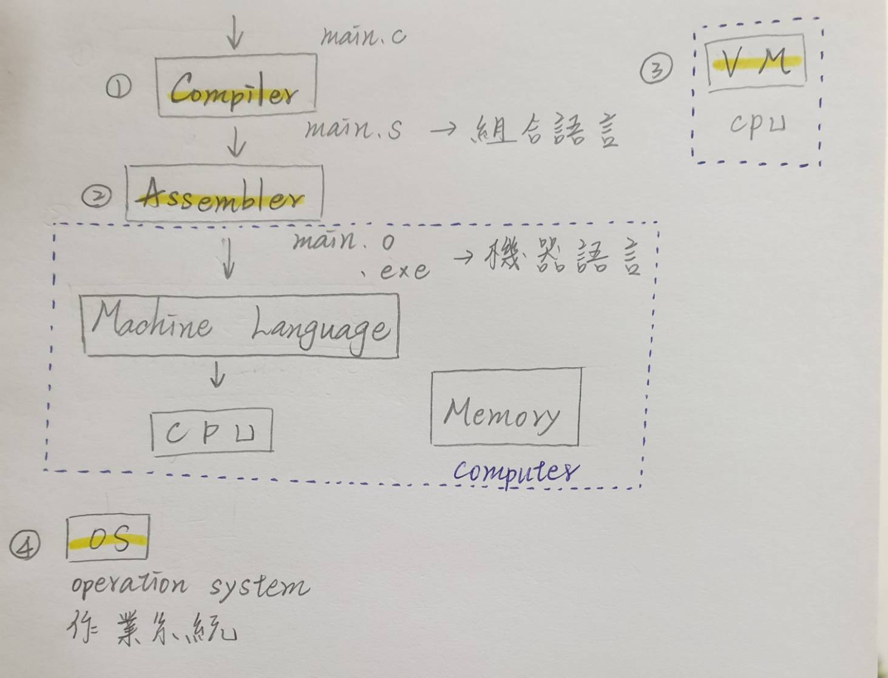
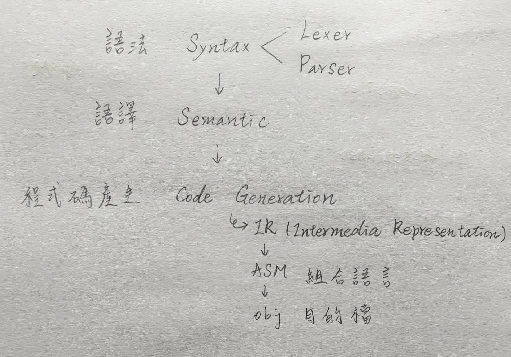
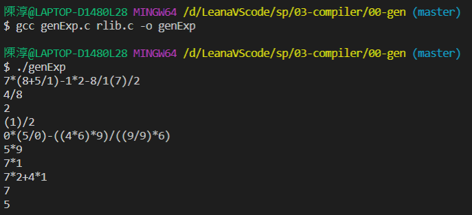
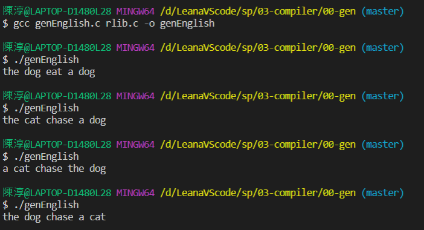
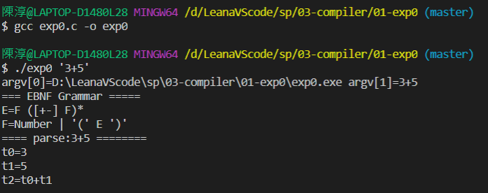
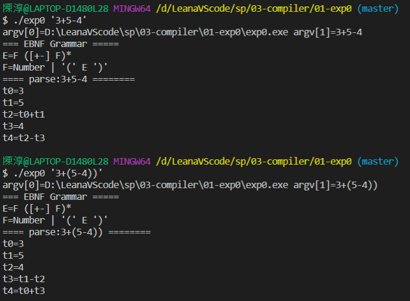
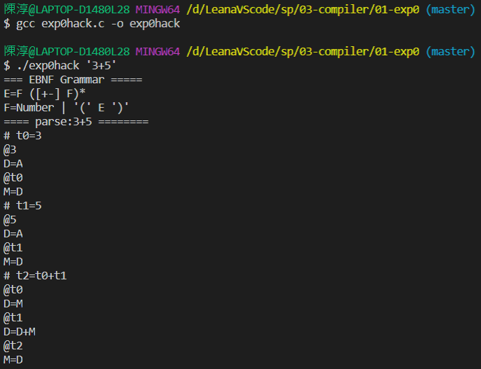

# 第二週

## 系統程式四大主題
* 編譯器

      把複雜運算式變簡單
* 組譯器
* 虛擬機

      優點:可以使用其他作業系統
      缺點:速度慢

* 作業系統

## 編譯器

* 不是所有格式都可以放入記憶體去執行

      例:Linux的elf格式是一行一行去做讀取，所以可以放入記憶體

## 編譯器可以區分成三階段

### 語法處裡

    先用Lexer詞彙解析器 再用Paser解析器

### 語意處理

    主要用於型態檢查

### 程式碼產生

    先產生IR(中間黨分器)
    再產生組合語言

## Paser理論基礎

### Grammar 語法
* 深層語法 Noam Chomsky

      沒有辦法嚴格規定 所以需要深度學習來做機器翻譯

* BNF(Backus Normal Form)

      是一種用於表示上下文無關文法的語言，上下文無關文法描述了一類形式語言

# 專案練習

## sp > 03-compiler

### 00-gen

#### 執行genExp.c

> 產生數學式

#### 執行genEnglish.c

> 產生句子

### 內容註解

> timeSeed是亂樹種子 每次結果都會不同

### 01-exp0

#### 執行exp0.c

>執行3+5

>比較3+5-4和3+(5-4)
>
>t的順序會因為有無括號而不同
>
>parse用來呼叫argv 而argv是自己打運算式

#### 執行exp0hack.c

> 直接產生3+5的組合語言

# 心得:

      我覺得看exp0hack.c的程式碼後 更加了解exp0.c的運作方式 其中透過exp0hack.c也讓我對組合語言更熟悉 統整上學期不太了解的問題 或是想不清楚地部分 都在這周課堂上解決 謝謝老師充分的解釋