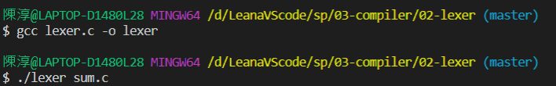
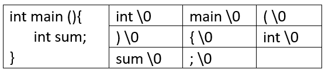
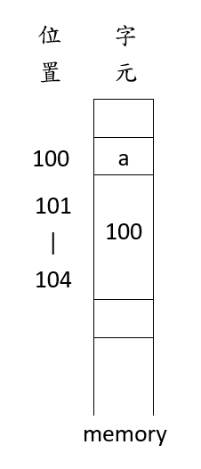
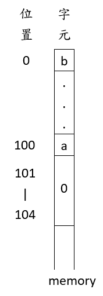

# 第三週

# 前情提要
## 編譯器 lex/if/while

* BNF/EBNF/生成語法
* Lexer
* 運算式編譯器
* if/While

# 專案執行

## sp>03-compiler

### 02-lexer 詞彙解析器
 

程式碼解讀:

每個token都是一個字串單元
用token表示詞彙

13  steTable[TMAX] 字串表  
14  char *tokens[TMAX] 

* 指標(記憶體位置)

> char *q,*r;  
> *q 指的就是字元指標  
> *r 指的就是字元  

>char x = 'a';  
>char *p = &x;  
>*p = 'b'  
>printf("")  

* char是一個字元 故只佔101
* 假設CPE是32位元 所以char*(指標)會佔101~104
* &x 中的&是指x的位置

>如果  
>char *p; #沒有給值  
>*p = 'b'; #造成系統錯誤  
> 這就是「野指標」

>int *p  
>p++;  #是+4 假設是32位元的話  
>p+3;  #是+12  
>要注意平台的位元  

>p++  
>在int中視家memory的位置  
>在memory中是加memory的值

49  isAlpha 讀取字母  
57  tokens 是把字元存入
58  是複製  
59  是補0  
67  先把lex指標設成code 

#### fopen 補充
      r 打开只读文件，该文件必须存在。

      r+ 打开可读写的文件，该文 件必须存在。

      rt+ 读写打开一个文本文件，允许读和写。

      w 打开只写文件，若文件存在则文件长度清为0，即该文件内容会消失。若文件不存在则建立该文件。

      w+ 打开可读写文件，若文件存在则文件长度清为零，即该文件内容会消失。若文件不存在则建立该文件。

      a 以附加的方式打开只写文件。若文件不存在，则会建立该文件，如果文件存在，写入的数据会被加到文件尾，即文件原先的内容会被保留。（EOF符保留）

      a+ 以附加方式打开可读写的文件。若文件不存在，则会建立该文件，如果文件存在，写入的数据会被加到文件尾后，即文件原先的内容会被保留。 （原来的EOF符不保留）

