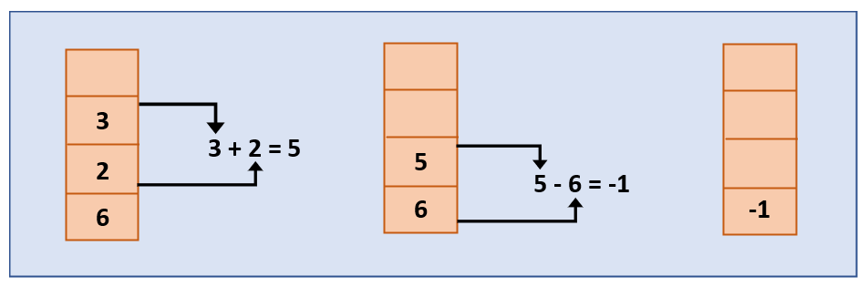
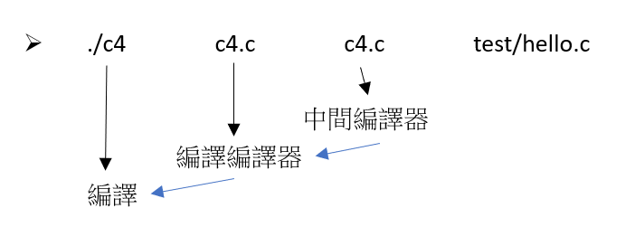

# 第五週

## 複習
### 虛擬機U9(上學期U6)
#### sp > 04-asm > 01-hack > vm.c
> 指令
$make  
$./asm add  
$./vm add.bin  
簡單版本

## 定義
>狹義 虛擬機模擬器  
>廣義 有指令集

>原生式虛擬機  
>寄生式虛擬機 Ex:VMWare VirrtualPC VirtualBox

>程式虛擬機 = 應用層虛擬機  
>Ex:Java Virtual Machine(JVM)是NET的CLR

## 架構
>memory machine   
register machine 暫存機  
stack machine 堆疊機

堆疊機和馮紐曼差異  
馮紐曼=register  
堆疊機=stack  

## 組合語言
一般  
>ADD R1,R2,R3  
R1=R2+R3

堆疊  
>PUSH 6  
PUSH 2  
PUSH 3  
ADD  
SUB   

## Java的虛擬機
在VScode下執行
> $multipass list  
#看新建的sp109b是否顯示running  
$multipass shell sp109b   
#啟動    
$gcc  
#看gcc是否可以啟用 如果不行就執行  
$sudo apt install gcc  
$java  
$sudo apt install default-jre  
$sudo apt install default-jdk  
以上表示前置作業設定已完成

## 專案執行

## sp > 03-compiler

創建  
multipass launch -n sp109b -c 4 -m 4G -d 40G

## sp > 06-vm > 01-jvm > readme.md

* QEMU  
可以在X86上跑

* Fabrice Bellard  
網頁版linux  

* Linux Benedict  
Linux 和 Git

## sp > c1-c4 > c4
if 中只有一個 =  
是因為存到裡面 但要同時判斷  

* END ADT 調整堆疊空間

