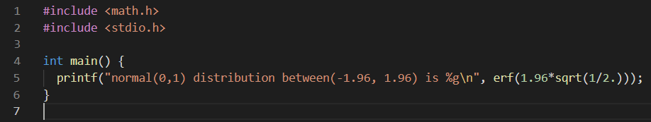
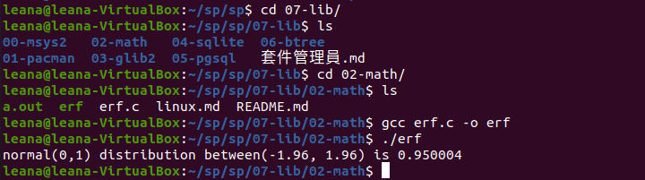

# 第八週

## POSIX可移植作業系統介面

 
# 專案練習

## sp > 07-lib 

### 02-math > erf.c

程式碼

執行過程

### 03-glib2 > glist.c

        /* Compile with:
        export CFLAGS="`pkg-config --cflags glib-2.0` -g -Wall -std=gnu11 -O3"
        export LDLIBS="`pkg-config --libs   glib-2.0`"
        make glist
        */
        #include <stdio.h>
        #include <glib.h>

        GList *list;

        int main(){
            list = g_list_append(list, "a");
            list = g_list_append(list, "b");
            list = g_list_append(list, "c");

            printf("The list is now %d items long\n", g_list_length(list));

            for ( ; list!= NULL; list=list->next)
                printf("%s\n", (char*)list->data);

            printf("The list is now %d items long\n", g_list_length(list));
        }

* g_list_append 是在glib裡面定義好了
* 查看要如何執行
* sudo apt-get install libglib2.0-dev  因為dev是給開發人員使用

### 04-sqlite 

#### sqlite_read.c

## sp > 08-posix

### 01-basic

        #include <stdio.h>
        #include <unistd.h>
        #include <assert.h>
        #include <fcntl.h>
        #include <sys/stat.h>
        #include <sys/types.h>
        #include <string.h>

        int main(int argc, char *argv[]) {
            int fd = open("hello.txt", O_WRONLY | O_CREAT | O_TRUNC, S_IRUSR | S_IWUSR);
            assert(fd >= 0);
            char buffer[20];
            sprintf(buffer, "hello world!\n");
            int rc = write(fd, buffer, strlen(buffer));
            assert(rc == (strlen(buffer)));
            fsync(fd);
            close(fd);
            return 0;
        }

*