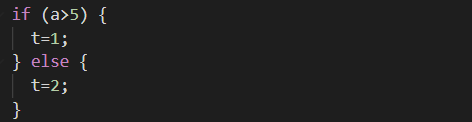
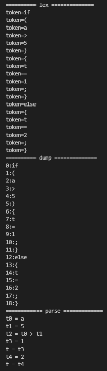
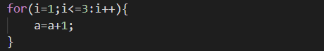
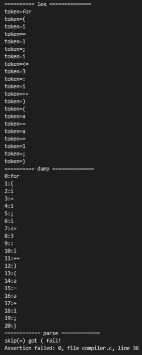

# 編譯器加上 IF 和 FOR 語法剖析與程式碼產生

接是用 03b-compiler2 來做更改  
因為裡面有 Makefile   
所以執行時在compiler.c那一層執行 `make`  

## if.c

### 執行結果
執行 `./compiler test/if.c`

## for.c

### 執行結果
執行 `./compiler test/for.c`

