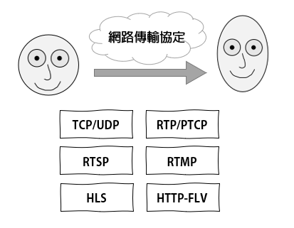
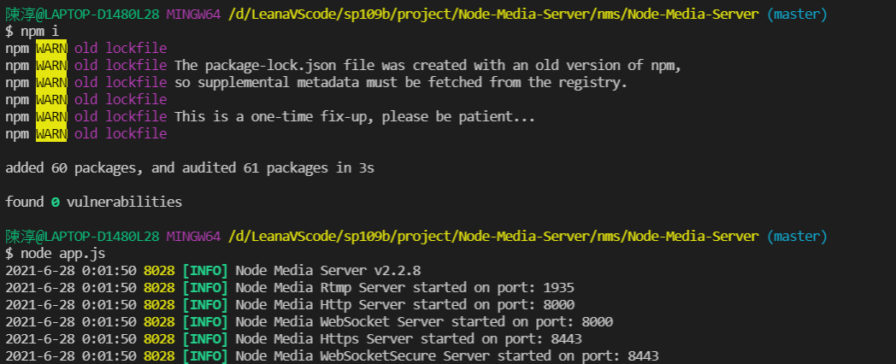

# 期末專案

* 主題 : Web server - 直播平台報告
* 作者 : 資工二 110810501 陳淳
* 作品 : 100%原創報告並參考網路程式碼解讀原理
* 指導老師 : 陳鍾誠 老師  

## 前言
由於科技的發達加上疫情的衝擊之下，越來越多人把時間花在手機和網路上面，而其中直播平台更是如雨後春筍般，一個一個冒出來，所以才會想要透過解析程式碼的方式，理解直播平台的原理，和系統之間的溝通模式。

## 直播平台溝通方式

>一. 聲音和影像的採集、編碼與壓縮  
二. 聲音和影像的封裝和傳輸  
三. 聲音和影像的拆封  

### 一. 聲音影像採集、編碼與壓縮  

#### 聲音Part
`PCM 脈波編碼調變`用麥克風把聲音轉成電腦看得懂的1和0   

> 位元率 (bps) = 採樣率(hz) x 採樣大小(bit) x 通道  

因為採集後的檔案會太大 故需要壓縮  
壓縮又可以分為 `失真壓縮`和`非失真性壓縮`  
可以依據自己選取的資料 分別選擇不同音訊範圍

* 失真壓縮
>把人耳聽不太清楚的雜音去掉

* 非失真性壓縮
> 簡單來說就是把電腦的二進位法 轉換成十進位法存放  
這樣空間才不會佔太大 也還是能夠還原  

並沒有說什麼方法會比較好 就看需要什麼選那一種方式就好

#### 影像Part
就是用一堆`像素`組合出來的圖片  
而影像就又是用一堆照片組合出來的影片

說到顏色 就會很自然地想到 RGB 和 YUV  
這是常見得顏色編碼

每個像素組合出來的圖片就叫做`幀`  
其中把起點和終點 定義成`關鍵幀`  
壓縮時 方便可以縮減中間變化不大的圖片
又有多種方式 圖像冗餘 時間冗餘 視覺冗餘 編碼冗餘

編碼也可以分為常見的兩種`H26X`和`VPX`

* H.264 和 [H.265](https://zh.wikipedia.org/wiki/%E9%AB%98%E6%95%88%E7%8E%87%E8%A7%86%E9%A2%91%E7%BC%96%E7%A0%81)

>主流 且 效率高

* [VP8](https://zh.wikipedia.org/wiki/VP8) 和 VP9

>以網路為主 所以以低品質頻寬處理

### 二. 聲音和影像的封裝和傳輸

#### 封裝
簡單來說 就是把影像和圖片壓縮到同一個資料夾
常見的方式有 `.wav`  `.mp4`  `.ogg`  `.flv/.f4v`  `.webm`  `.ts` 

* [.wav](https://zh.wikipedia.org/wiki/WAV)
> 音訊編碼
* [.mp4](https://zh.wikipedia.org/wiki/MP4)
>視訊檔格式
* [.ogg](https://zh.wikipedia.org/wiki/Ogg)
>是一種檔案格式 可以包含影音文字等
* [.flv/.f4v](https://zh.wikipedia.org/wiki/Flash_Video)
>視訊檔格式 但會檔案太大 網路上使用不便
* [.webm](https://zh.wikipedia.org/wiki/WebM)
>自由格式 
* [.ts](https://zh.wikipedia.org/wiki/MPEG2-TS)
>標準數位封裝格式 傳輸媒介是地面和衛星

#### 傳送Part
1.用傳檔案的方式  
2.用串流的方式傳送  

3.用直播方式傳送  

>其中網路協定的說明 放在大一下的筆記裡

### 三. 聲音和影像的拆封  
`ffmpeg` 用來轉碼用的  
>個人覺得這篇文章寫得很詳細 不用我在多做說明  
參考[https://ithelp.ithome.com.tw/articles/10207695](https://ithelp.ithome.com.tw/articles/10207695)

## 執行結果
先把專案下載下來

    git clone https://github.com/illuspas/Node-Media-Server

執行

    npm i
    node app.js

執行成功畫面

## 參考資料與版權申明:
[illuspas LICENSE](https://github.com/illuspas/Node-Media-Server/blob/master/LICENSE)  
[illuspas](https://github.com/illuspas/Node-Media-Server)  

[buyingfei](https://github.com/buyingfei/live)  
[建立的像 17 一樣的直播功能呢 ?](https://ithelp.ithome.com.tw/articles/10208242)  
[MyDearGreatTeacher](https://github.com/MyDearGreatTeacher/streaming)  
